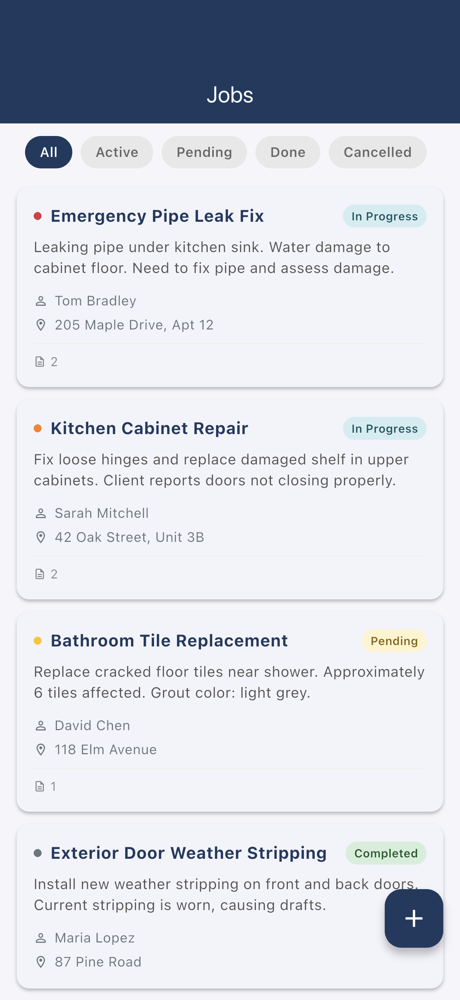
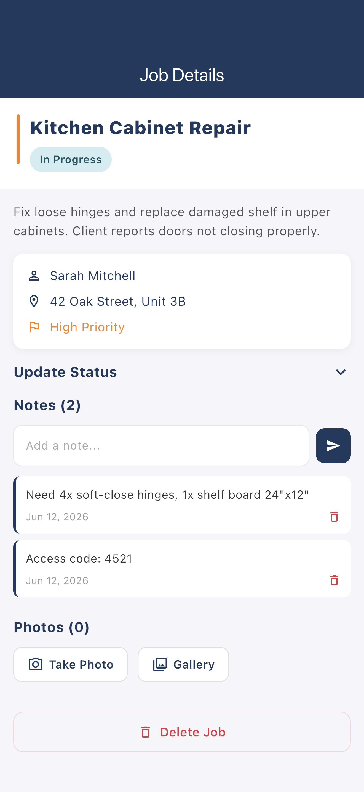
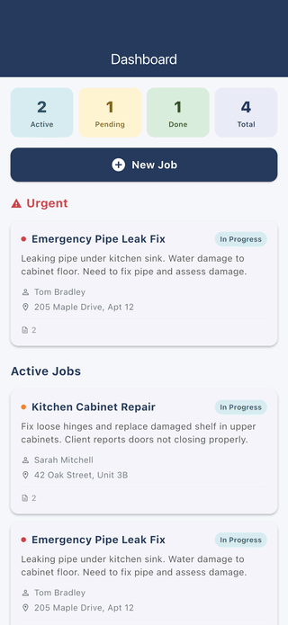

# Flutter Job Tracker

An offline-first field-service job tracker built with Flutter and Riverpod. Tradespeople can manage jobs by priority and status, track per-job notes and photos, and see a live dashboard of active, pending, and completed work. All data is persisted locally with Hive, so the app keeps working with no network.

## Demo

These are real iOS-Simulator captures, generated by an integration-test driver (no mockups). See [FLOW.md](FLOW.md) for how they were produced.

| Dashboard | Jobs list | Job detail |
| --- | --- | --- |
|  |  |  |

## Features

- Dashboard with live stats (active, pending, done, total) plus urgent and active job sections.
- Job list with status filter chips and priority-based sorting (urgent, high, medium, low).
- Job detail with client info, address, priority, status updates, notes, and photo attachments.
- Create new jobs with title, description, client, address, and priority.
- Offline-first persistence with Hive, so all data is saved locally and survives restarts.

## Stack

- Flutter (Material 3)
- Riverpod (StateNotifier) for state management
- go_router for navigation
- Hive for local storage
- image_picker for photo attachments
- intl, uuid utilities
